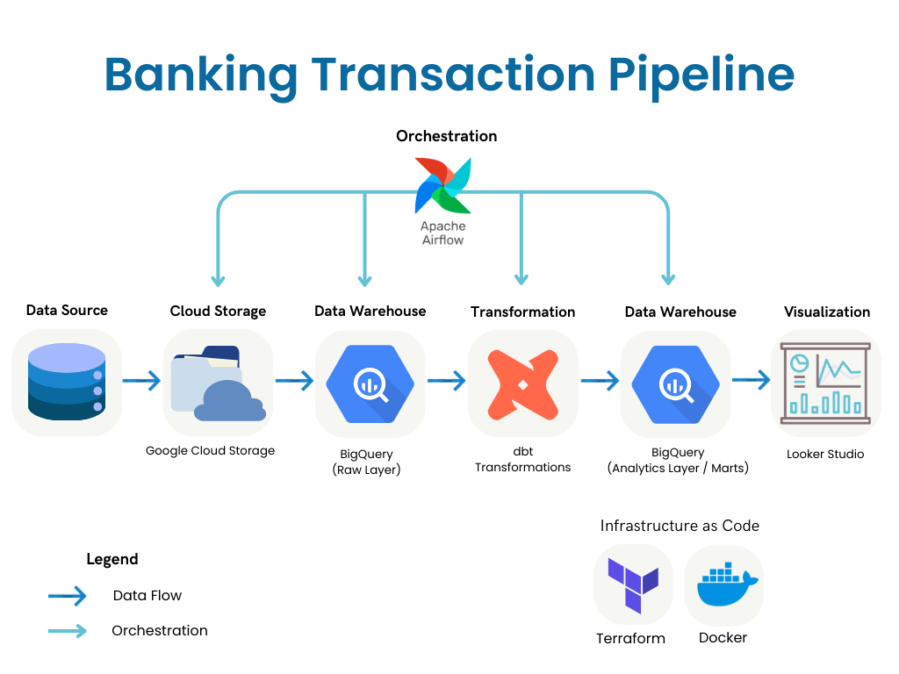

# Banking Transaction Data Pipeline

This project implements an **end-to-end batch data engineering pipeline** for processing inter-bank payment transactions.
It demonstrates how banking transaction data can be ingested, stored, transformed, and aggregated into analytics-ready tables using **industry-standard tooling and best practices**.

The pipeline emphasizes:

* Batch correctness over real-time complexity
* Clear separation of raw, staging, and reporting layers
* Reproducibility using Infrastructure as Code and containerized orchestration

---
## Table of Contents

- [Problem Statement](#problem-statement)
- [Overview](#overview)
- [Dataset](#dataset)
- [Architecture](#architecture)
- [High-Level Architecture](#high-level-architecture)
- [Tech Stack](#tech-stack)
- [Prerequisites](#prerequisites)
- [Quick Start Guide](#quick-start-guide)
- [Detailed Setup Instructions](#detailed-setup-instructions)
- [dbt Transformations](#dbt-transformations)
- [Data Quality & Testing](#data-quality--testing)
- [Project Structure](#project-structure)
- [Acknowledgements](#acknowledgements)

---

## Problem Statement

As a core component of the financial system, banks process large volumes of inter-bank payment transactions every day. These transactions support a wide range of economic activities, including fund transfers, settlements, and cross-border payments.

In practice, inter-bank transaction data is typically generated by multiple source systems and arrives incrementally throughout the day. Without a structured and automated data pipeline, banks risk:

* Inconsistent settlement figures
* Delayed reporting
* Poor auditability of transaction flows

This project simulates how such inter-bank payment data can be handled using a **reliable batch-oriented data pipeline**, closely reflecting real-world banking data engineering patterns.

---

### Overview

This project implements an end-to-end batch data engineering pipeline for processing inter-bank payment transactions. The pipeline ingests synthetic inter-bank transaction data containing information such as sender and receiver banks, transaction amounts, currencies, and timestamps.

The data pipeline follows a layered architecture, where raw transaction data is first stored in a data lake to preserve the original records for audit and traceability purposes. The data is then loaded into BigQuery for transformation and analysis.

Workflow orchestration is handled using Apache Airflow, enabling the pipeline to run on a scheduled basis and ensuring that each stage of the data lifecycle—ingestion, loading, transformation, and reporting—executes reliably and in the correct sequence.

The final output of the project consists of structured reporting tables and visualizations that allow users to:

- Monitor daily and monthly inter-bank transaction volumes
- Analyze settlement amounts by bank, currency, and payment format
- Support reconciliation and operational reporting needs
- Detect potential risk patterns and anomalies

## Architecture


### Dashboard 
The dashboard can be accessed via [Looker Studio](https://lookerstudio.google.com/reporting/3e5c5ca1-4f0a-4bdc-966a-fe3b4264704a)


---

## Dataset

* **Source:** [IBM Synthetic AML Transaction Dataset](https://www.kaggle.com/datasets/ealtman2019/ibm-transactions-for-anti-money-laundering-aml)
* **File used:** `LI-Medium_Trans.csv`

**Characteristics:**

* Inter-bank transfers
* Transaction timestamps
* Bank and account identifiers
* Payment amounts and currencies
* Payment formats (ACH, wire transfer, cheque)
* AML (Anti-Money Laundering) flags

The dataset is **fully synthetic** and safe for demonstration purposes.

---

## High-Level Architecture

```
Local CSV
  ↓
Google Cloud Storage (Raw Data Lake)
  ↓
BigQuery (interbank_raw)
  ↓
dbt Transformations
  ↓
Analytics-Ready Tables
  ↓
Looker Studio Dashboards
```

---

### Orchestration Flow

```
Airflow DAG: interbank_batch_pipeline
└── ingest_to_gcs
    └── load_gcs_to_bigquery
        └── trigger_dbt_cloud_job
```

---

## Tech Stack

| Component | Technology | Purpose |
|-----------|------------|---------|
| Cloud Platform | Google Cloud Platform | Infrastructure hosting |
| Data Lake | Cloud Storage | Raw data storage |
| Data Warehouse | BigQuery | Analytical queries |
| Infrastructure | Terraform | Infrastructure as Code |
| Orchestration | Apache Airflow | Workflow scheduling |
| Transformation | dbt Cloud | SQL-based transformations |
| Ingestion | Python | Data loading scripts |
| Containerization | Docker | Local reproducible runtime |
| Visualization | Looker Studio | Reporting dashboards |

---

## Prerequisites

Before you begin, ensure you have the following installed:

- [ ] [Docker](https://docs.docker.com/get-docker/) (v20.10+)
- [ ] [Docker Compose](https://docs.docker.com/compose/install/) (v2.0+)
- [ ] [Terraform](https://developer.hashicorp.com/terraform/downloads) (v1.3+)
- [ ] [Google Cloud SDK](https://cloud.google.com/sdk/docs/install) (gcloud CLI)
- [ ] [Python](https://www.python.org/downloads/) (v3.9+)
- [ ] A [GCP Account](https://cloud.google.com/) with billing enabled
- [ ] A [dbt Cloud Account](https://www.getdbt.com/product/dbt-cloud) (free tier available)

---

## Quick Start Guide

```bash
# 1. Clone the repository
git clone https://github.com/Sefviaaa/banking-transaction-pipeline.git
cd banking-transaction-pipeline

# 2. Download the dataset
# Download LI-Medium_Trans.csv from Kaggle and place it in: 
# ingestion/data/raw/LI-Medium_Trans.csv

# 3. Set up GCP infrastructure
cd infra/terraform
cp terraform.tfvars.example terraform.tfvars  # Edit with your project ID
terraform init
terraform apply

# 4. Configure environment
cd ../../orchestration
cp .env.example .env  # Edit with your credentials

# 5. Set up GCP credentials
mkdir -p credentials
# Place your service account JSON key as credentials/credentials.json

# 6. Set up dbt profile
mkdir -p ~/.dbt
cp ../dbt/profiles.yml.example ~/.dbt/profiles.yml  # Edit with your project ID

# 7. Start the pipeline
docker compose up -d

# 8. Access Airflow UI
open http://localhost:8080  # Login: admin / admin
```

---

## Detailed Setup Instructions

### Step 1: Clone the Repository

```bash
git clone https://github.com/Sefviaaa/banking-transaction-pipeline.git
cd banking-transaction-pipeline
```

### Step 2: Download the Dataset

1. Go to [Kaggle - IBM Transactions for AML](https://www.kaggle.com/datasets/ealtman2019/ibm-transactions-for-anti-money-laundering-aml)
2. Download `LI-Medium_Trans.csv`
3. Create the data directory and move the file:

```bash
mkdir -p ingestion/data/raw
mv ~/Downloads/LI-Medium_Trans.csv ingestion/data/raw/
```

### Step 3: Set Up Google Cloud Platform

#### 3.1 Create a GCP Project

```bash
# Create a new project (or use existing)
gcloud projects create your-project-id --name="Banking Pipeline"
gcloud config set project your-project-id

# Enable required APIs
gcloud services enable bigquery.googleapis.com
gcloud services enable storage.googleapis.com
```

#### 3.2 Create a Service Account

```bash
# Create service account
gcloud iam service-accounts create banking-pipeline \
    --display-name="Banking Pipeline Service Account"

# Grant permissions
gcloud projects add-iam-policy-binding your-project-id \
    --member="serviceAccount:banking-pipeline@your-project-id.iam.gserviceaccount.com" \
    --role="roles/bigquery.admin"

gcloud projects add-iam-policy-binding your-project-id \
    --member="serviceAccount:banking-pipeline@your-project-id.iam.gserviceaccount.com" \
    --role="roles/storage.admin"

# Download credentials
gcloud iam service-accounts keys create orchestration/credentials/credentials.json \
    --iam-account=banking-pipeline@your-project-id.iam.gserviceaccount.com
```

### Step 4: Provision Infrastructure with Terraform

```bash
cd infra/terraform

# Create your variables file
cat > terraform.tfvars << EOF
project_id  = "your-project-id"
region      = "US"
bucket_name = "your-unique-bucket-name"
EOF

# Initialize and apply
terraform init
terraform apply
```

This creates:
- GCS bucket for raw data
- BigQuery datasets: `interbank_raw`, `interbank_dbt_dev`, `interbank_prod`

### Step 5: Configure Environment Variables

```bash
cd ../../orchestration

# Copy the example file
cp .env.example .env

# Edit .env with your values
nano .env  # or use your preferred editor
```

Your `.env` file should contain:

```bash
# GCP Configuration
GCP_PROJECT_ID=your-project-id
GCS_RAW_BUCKET=your-unique-bucket-name
GOOGLE_APPLICATION_CREDENTIALS=/opt/airflow/google/credentials.json

# dbt Cloud Configuration
DBT_CLOUD_ACCOUNT_ID=your_dbt_account_id
DBT_CLOUD_API_TOKEN=your_dbt_api_token
DBT_CLOUD_JOB_ID=your_dbt_job_id

# Airflow Security
AIRFLOW_SECRET_KEY=your-secure-random-string-here
```

### Step 6: Set Up dbt Cloud

1. **Create a dbt Cloud account** at [getdbt.com](https://www.getdbt.com/)
2. **Connect your repository** to dbt Cloud
3. **Configure BigQuery connection** in dbt Cloud:
   - Upload your service account JSON key
   - Set the project and dataset
4. **Create a dbt Cloud job** and note the Job ID
5. **Generate an API token** from dbt Cloud settings
6. **Update your `.env`** with the dbt Cloud credentials

### Step 7: Set Up dbt Profile (for local development)

If you want to run dbt locally (optional):

```bash
mkdir -p ~/.dbt

cat > ~/.dbt/profiles.yml << EOF
banking_transaction_pipeline:
  target: dev
  outputs:
    dev:
      type: bigquery
      method: service-account
      project: your-project-id
      dataset: interbank_dbt_dev
      location: US
      threads: 4
      keyfile: /path/to/your/credentials.json
    prod:
      type: bigquery
      method: service-account
      project: your-project-id
      dataset: interbank_prod
      location: US
      threads: 4
      keyfile: /path/to/your/credentials.json
EOF
```

### Step 8: Start the Pipeline

```bash
cd orchestration

# Build and start containers
docker compose up -d

# Check logs
docker compose logs -f
```

### Step 9: Access Airflow and Trigger the Pipeline

1. Open **http://localhost:8080** in your browser
2. Login with:
   - Username: `admin`
   - Password: `admin`
3. Find the DAG: `interbank_batch_pipeline`
4. Toggle the DAG **ON**
5. Click **Trigger DAG** to run manually

### Step 10: Verify the Results

```bash
# Check BigQuery for data
bq query --use_legacy_sql=false \
  'SELECT COUNT(*) FROM `your-project-id.interbank_raw.transactions`'

# Check dbt Cloud for transformation results
bq query --use_legacy_sql=false \
  'SELECT * FROM `your-project-id.interbank_prod.fact_transactions_daily` LIMIT 10'
```

---

## dbt Transformations

The Airflow DAG triggers a **dbt Cloud job** via API.

### What the dbt job does

* Runs staging models
* Builds dimension tables
* Aggregates daily transaction facts
* Produces reporting tables
* Executes dbt tests

### Data Model Architecture

```
stg_interbank_transactions (staging)
    │
    ├── fact_transactions (granular fact table)
    │       │
    │       ├── fact_transactions_daily
    │       ├── rpt_hourly_volume
    │       ├── rpt_currency_flow
    │       ├── rpt_bank_flow_matrix
    │       ├── rpt_risk_summary
    │       └── rpt_pipeline_health
    │
    ├── dim_bank
    └── dim_currency
```

### Target Datasets

* **Development:** `interbank_dbt_dev`
* **Production:** `interbank_prod`

### Key Models
### Key Models

| Layer | Model | Description |
|-------|-------|-------------|
| Staging | `stg_interbank_transactions` | Type casting, timestamp normalization, column standardization |
| Fact | `fact_transactions` | Granular fact table with all transaction details |
| Fact | `fact_transactions_daily` | Daily aggregated transactions by bank and currency |
| Dimension | `dim_bank` | Bank reference data |
| Dimension | `dim_currency` | Currency reference data |
| Report | `rpt_hourly_volume` | Hourly transaction volume for heatmap analysis |
| Report | `rpt_currency_flow` | Currency exchange flow analysis |
| Report | `rpt_bank_flow_matrix` | Bank-to-bank transaction patterns |
| Report | `rpt_risk_summary` | AML flag rates and risk metrics |
| Report | `rpt_pipeline_health` | Pipeline monitoring metrics |

## Data Quality & Testing

Implemented using dbt tests:

* `not_null` checks on critical fields
* `unique` constraints on primary keys
* Referential integrity (`relationships`)
* Custom metric sanity checks

These ensure analytical outputs remain **consistent, auditable, and trustworthy**.

---

## Dashboards

The pipeline includes three Looker Studio dashboards for different stakeholders:

### Dashboard Overview

| Dashboard | Audience | Purpose |
|-----------|----------|---------|
| **Executive Summary** | Business Leaders | High-level KPIs, trends, and business insights |
| **Operational Monitoring** | Data Engineers | Pipeline health, data freshness, processing metrics |
| **Risk Analytics** | Risk Analysts | AML monitoring, anomaly detection, suspicious patterns |

### Data Sources for Dashboards

| Dashboard | BigQuery Tables |
|-----------|-----------------|
| Executive Summary | `fact_transactions_daily`, `rpt_currency_flow` |
| Operational Monitoring | `rpt_hourly_volume`, `rpt_pipeline_health` |
| Risk Analytics | `rpt_risk_summary`, `rpt_bank_flow_matrix` |

### Dashboard 1: Executive Summary

**Key Metrics:**
- Total Transaction Volume
- Total Amount Processed
- Average Transaction Size
- Active Banks Count

**Visualizations:**
- Daily Transaction Trend (Time Series)
- Top 10 Banks by Volume (Bar Chart)
- Transactions by Currency (Donut Chart)
- Currency Exchange Flow (Table with Heatmap)

### Dashboard 2: Operational Monitoring

**Key Metrics:**
- Last Data Refresh Timestamp
- Records Processed
- Unique Source/Destination Banks

**Visualizations:**
- Hourly Transaction Heatmap (Pivot Table)
- Daily Record Count
- Hourly Volume Distribution (Area Chart)
- Pipeline Health Weekly Summary Table

### Dashboard 3: Risk Analytics

**Key Metrics:**
- Overall Flag Rate (Gauge)
- Total Flagged Transactions
- Amount at Risk

**Visualizations:**
- Flag Rate by Payment Format (Bar Chart)
- Flag Rate by Value Tier (Bar Chart)
- Bank-to-Bank Flow Matrix (Pivot Heatmap)
- Top Suspicious Bank Pairs (Table)
  
## Project Structure
```
banking-transaction-pipeline/
├── .github/
│   └── workflows/
│       └── ci.yml                    # CI/CD pipeline
│
├── ingestion/
│   ├── data/
│   │   └── raw/
│       │   └── LI-Medium_Trans.csv   # not committed
│   ├── load_to_gcs.py                # Upload to GCS
│   └── load_gcs_bq.py                # Load to BigQuery
│
├── orchestration/
│   ├── dags/
│   │   └── interbank_batch_dag.py
│   ├── credentials/
│   │   └── credentials.json          # not committed
│   ├── docker-compose.yml
│   ├── Dockerfile
│   ├── requirements.txt
│   ├── .env                          # not committed
│   └── .env.example
│
├── dbt/
│   ├── models/
│   │   ├── staging/
│   │   │   ├── stg_interbank_transactions.sql
│   │   │   └── schema.yml
│   │   ├── marts/
│   │   │   ├── fact_transactions.sql
│   │   │   ├── fact_transactions_daily.sql
│   │   │   ├── dim_bank.sql
│   │   │   ├── dim_currency.sql
│   │   │   ├── rpt_hourly_volume.sql
│   │   │   ├── rpt_currency_flow.sql
│   │   │   ├── rpt_bank_flow_matrix.sql
│   │   │   ├── rpt_risk_summary.sql
│   │   │   ├── rpt_pipeline_health.sql
│   │   │   └── schema.yml
│   │   └── sources.yml
│   ├── dbt_project.yml
│   ├── packages.yml
│   └── profiles.yml.example
│
├── infra/
│   └── terraform/
│       ├── main.tf
│       ├── variables.tf
│       ├── outputs.tf
│       └── terraform.tfvars          # not committed
│
├── docs/
│   ├── DASHBOARDS.md                 # Detailed dashboard documentation
│   └── images/
│       ├── dashboard_executive.png
│       ├── dashboard_operations.png
│       └── dashboard_risk.png
│
├── .gitignore
└── README.md
```

---

## Acknowledgments

- IBM for the synthetic AML transaction dataset
- The dbt, Airflow, and Terraform communities
- Google Cloud Platform for infrastructure services
